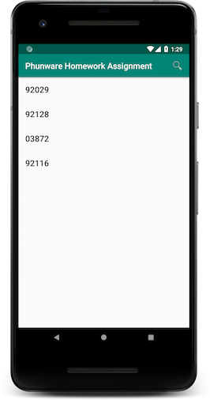
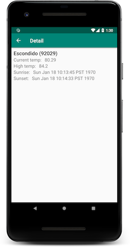
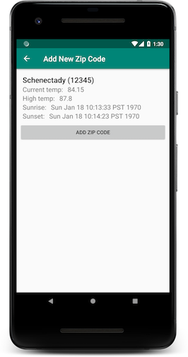

# Phunware Product Homework Assignment
## Screenshots
|Zip code list              |  Zip code detail         |  Zip code add |
|-------------------------|-------------------------|-------------------------|
|  |   | |

The following list-based application is a barebones weather app that retrieves its weather from the [OpenWeatherAPI](https://openweathermap.org/api).  The app currently allows users to look up weather for a given zip code, and save the zip code for later viewing of weather.

- Please add as many features (from the list below, or of your own creativity!) as you can in the time allotted to the existing app.
- Please resolve all of the bugs listed.

Your submission will be evaluated for creativity, attention to best practices, and code style (is it clean looking code? does it read easily?).

Once you have completed the assignment to the best of your ability please send the hiring manager a link to a GitHub or BitBucket repository containing the project. **Your work should be in its own branch, called _review_ to allow us to easily compare it with the base app**. You will be required to present your project assignment. The presentation and questions shouldn't last longer than 30 minutes. 

## Some notes about the base app
- The app is provided as a Kotlin version (app-kotlin) and a Java version (app-java).  You can work on whichever version you feel the most comfortable with.
- The app leverages Google's Architecture Components, such as Lifecycle, LiveData, ViewModel and Navigation.  It is encouraged that you leverage available Architecture Components in any new features you may add as part of this assignment.
- The app leverages Dagger 2 to handle dependency injection.  It is encouraged that you leverage Dagger 2 for any new features you may add as part of this assignment.
- The app follows the Phunware code style for Java and Kotlin.  The Phunware code style for Java loosely matches [Google's own](https://google.github.io/styleguide/javaguide.html) and the code style for Kotlin is simply [Android Kotlin Style](https://android.github.io/kotlin-guides/style.html).  Any code you add should also follow the appropriate code style.  (If you find any mistakes we made, bonus points!)
- Since this app uses the Navigation Architecture Component, you will have to use at least Android Studio 3.2.x Beta (or Android Studio 3.3.x Canary).  See [Set up navigation in a project](https://developer.android.com/topic/libraries/architecture/navigation/navigation-implementing) for instructions.

## Assignment Tasks

### Features to add
Implement as many as you are comfortable with.  The more the better!

1. Settings screen to change units to Celsius
2. Add room integration for persistent storage of zip codes instead of in memory storage only
3. Background sync of weather using WorkManager (only appropriate if you implement persistent storage of zip codes and weather) .
4. Implement nice UI for zip code list that shows the location of the zip code and its current weather (maybe a location specific image and image that indicates cloudy/sunny/raining/snowing?)
5. Display google maps (static image) with a pin on the zip code lat/lng on details.
6. Add support for deleting saved zip codes.
7. Weather API key is hardcoded.  Make this configurable some how.
8. Make a Dagger2 module to inject the weather SDK instead of the WeatherSDK being instantiated directly in your app module.

### Bugs to fix
Resolve all of these bugs.

1. Should only be able to enter zip codes that are 5 digits long
2. Sunrise/Sunset not displayed in local time
3. Weathersdk should be injected by dagger
4. If airplane mode is on, app will load indefinitely when trying to look at the weather for an added zip code or searching for a new zip code.  It should show cached data (if feature implemented) or an error indication if not available.
5.  Low temp for zip code is never shown

## Reading material
- [Android Architecture Components](https://developer.android.com/topic/libraries/architecture/)
	- [The Navigation Architecture Component](https://developer.android.com/topic/libraries/architecture/navigation/)
	- [LiveData Overview](https://developer.android.com/topic/libraries/architecture/livedata)
	- [ViewModel Overview](https://developer.android.com/topic/libraries/architecture/viewmodel)
	- [Samples for Android Architecture Components](https://github.com/googlesamples/android-architecture-components)
- [Android Design Guidelines](https://developer.android.com/design/)
- [Using Dagger 2 for dependency injection in Android](http://www.vogella.com/tutorials/Dagger/article.html)